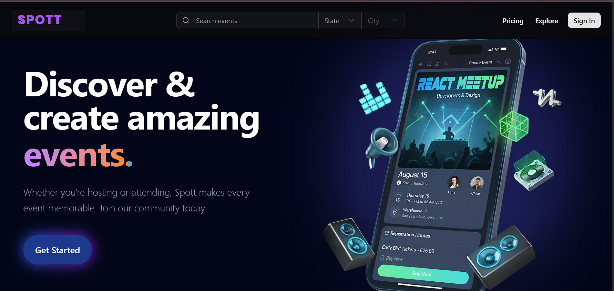

## Spott : A Next.js based AI-enhanced platform for creating, managing, and sharing events.
Welcome to Spott, a modern event management platform where users can discover venues, plan events, and manage bookings effortlessly. Built with Next.js, Clerk, and Convex, it offers secure authentication, real-time data handling, and an intelligent AI layer for smart event decisions.


 [](event-7rvx.vercel.app)




### Features :

- AI-powered event planning suggestions based on user preferences
- Region-wise venue exploration across multiple cities in India
- Event creation & management with tasks, schedules, and guest lists
- Secure login and user authentication powered by Clerk
- Real-time data syncing and storage using Convex
- Vendor listing, selection, and booking (decorators, catering, venues, etc.)
-  Budget estimation system with AI-driven recommendations
- User dashboard with event analytics and planning progress
- Booking & payment management with history and invoice generation

### Tech Stack

**Frontend:**

- **Next.js 15.3.3** - React framework with App Router
- **TypeScript** - Type-safe JavaScript
- **Tailwind CSS 4** - Utility-first CSS framework
- **Motion** - Animation library
- **shadcn/ui** - Pre-built components
- **React Hook Form** - Form management with Zod validation

**Backend & Database:**

- **Clerk** - Modern authentication system with social login & user management
- **Convex** - Real-time database, backend functions, and state management
- **Next.js API Routes** - Server-side endpoints

 **AI & Chat:**

- **Google Gemini AI** - AI chat functionality
- **Custom AI agents** - Subject-specific chatbots

  **Payment & Premium:**

- **Clerk Role-based Access** - Payment gateway
- **Hierarchical tier system** - Premium access control

  **Development Tools:**

- **ESLint** - Code linting
- **Prettier** - Code formatting

 
## Contributing & Installation

### Installation

1. **Clone the repository**

   ```bash

    # For Windows

    # For Mac/Linux

    cd spott

    cd spott
   ```

2. **Install dependencies**

```bash
npm install
```

3. **Environment Setup**
   Create a `.env.local` file with the following variables:

   ```env
   # Database
   CONVEX_DEPLOYMENT=

   NEXT_PUBLIC_CONVEX_URL=

   NEXT_PUBLIC_CLERK_PUBLISHABLE_KEY=
   CLERK_SECRET_KEY=

   NEXT_PUBLIC_CLERK_SIGN_IN_URL=/sign-in
   NEXT_PUBLIC_CLERK_SIGN_UP_URL=/sign-up

   CLERK_JWT_ISSUER_DOMAIN=

   NEXT_PUBLIC_UNSPLASH_ACCESS_KEY=

   GEMINI_API_KEY=

   <!-- Check .env.example for all the vars -->

   ```
    
4. **Database Setup**

   ```bash
   npx convex dev
   ```

5. **Start development server**

   ```bash
   npm run dev
   
   ```
   

## 📄 License

This project is licensed under the **MIT License**.  
See the [LICENSE](./LICENSE) file for more information.


